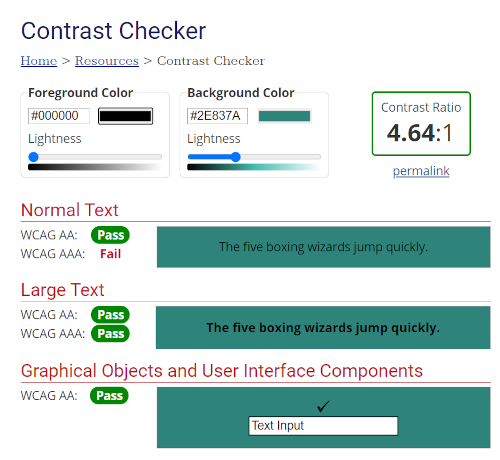
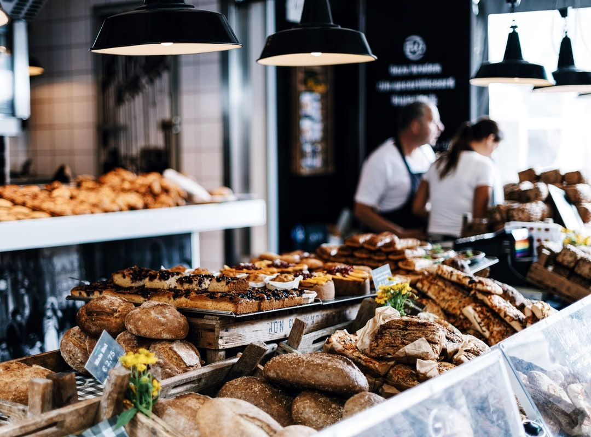

# **Days Gone Pie**
### **Milestone Project 3 - Python and DataCentric Development**

## **Table of Contents**
---
## **1 | UX** 
- Project Goals
- User Goals
- Developer Goals
- User Stories
- Design Choices
- Wireframes
---
## **2 | Features**
- Existing Features
- Features to Implement
---
## **3 | Technologies Used**
- Front and Back End Languages
- External Librarys and Frameworks
- Validation Tools
---
## **4 | Testing**
---
## **5 | Deployment**
- Cloning the project
- How to Deploy Locally
- How to Deploy to a Cloud Based Server
- Version Control
---
## **6 | Credits**
- Content
- Media
- Code
- Acknowledgements
---
## **1 | UX**
---
### **Project Goals**
The purpose of Days Gone Pie is to create an attractive, functional, fullstack website for baking enthusiasts of all skill levels and abilities.

### **User Goals**
*Days Gone Pie is targeted at baking enthusiasts who want to:*
- Find new / specific recipes
- Learn new skills
- Share recipes with the community
- Review shared recipes

*Days Gone Pie is a great way to help users meet these needs by:*
- Providing access to a library of recipes for all ages and abilities
- Aid novice bakers in developing their skills by trying new recipes and techniques
- Giving the user the bility to share their recipes with the online community
-Review shared recipes to help inform other users

### **Developer Goals**
*As the developer of Days Gone Pie, the goal is to:*
- Exhibit a professional looking front end site using HTML, CSS and JavaScript
- Design, develop and implement a back end application using Python
- Use Flask and MongoDB to create and manipulate Data
- Successfully deploy a full stack site to a cloud platform such as Heroku
- Prectise defensive design by identifying security features.

### **User Stories**
*As a user, interested in baking, I want:*
- The ability to search for and easily navigate to a recipes
- To know how many people the recipe serves and how long it will take to make
- To know if the recipe is suitable for people with allergies or special dietary requirements
- To know if the recipe is suitable for vegetarians or vegan friendly
- A clear list of ingredients I will need to make the recipe
- A structured step by step method of how prepare the recipe
- To look for handy tips that help me improve
- Advice on ingredients
- Create a user profile to manage my recipes
- To share my recipes with the community
- To be able to update or delete my recipes

### **Design Choices**
Days Gone Pies was designed to look clean, modern and attractive to the user.
It needed to accentuate the theme and content of the website without overpowering the
user visually.  I felt it needed to replcate the structure of a cake, be light, airy and tempt
the user into another helping.

*The following design choices were made with these decisions in mind:*

#### **Fonts**
I selected my primary and secondary fonts from [Google Fonts](https://fonts.google.com/).
For headers and button text, I used the ['Poppins'](https://fonts.google.com/specimen/Poppins?preview.text_type=custom#about) font, with the ['Open Sans'](https://fonts.google.com/specimen/Open+Sans?preview.text_type=custom)
font for the main body.  The two fonts complimented each other and kept the site looking clean and modern.
As the user will be following recipes and instructions, it was important to use a typeface that was easy on the eyes and could be clearly understood.

#### **Icons**
All of the icons used were generated by [FontAwesome](https://fontawesome.com/). Each icon was used in a situation where it applied to the content infront of the user,
providing a simpler user experience. By providing a visual aid to support the text content, the user would be more equiped to navigate the website efficently.

*The following icons were used:*
- [Book - open](https://fontawesome.com/icons/book-open?style=solid) | Recipe title
- [Folder - open](https://fontawesome.com/icons/folder-open?style=regular) | Recipe category
- [Chart - pie](https://fontawesome.com/icons/chart-pie?style=solid) | Recipe servings
- [Clock](https://fontawesome.com/icons/clock?style=regular) | Recipe preparation / cooking Times
- [File - alt](https://fontawesome.com/icons/file-alt?style=regular) | Recipe description
- [List - ul](https://fontawesome.com/icons/list-ul?style=solid) | Recipe ingredients
- [List - ol](https://fontawesome.com/icons/list-ol?style=solid) | Recipe method
- [Username](https://fontawesome.com/icons/user-tag?style=solid) | User registration / login
- [Password](https://fontawesome.com/icons/key?style=solid) | User password

#### **Colors**
The theme of the website needed to be light and airy, just like a cake sponge.
Pastel colors seemed to be the most logical approach. I used [HTML Colorcodes](https://htmlcolorcodes.com/color-picker/)
to help choose the right shade.

To allow the user to read the content properly required a conforming text contrast.
Even though the test failed for smaller writing, I was happy to continue with the selection
as my headers and bolder text were greater in number and deemed an accepltable trade off.

For buttons and call to cation functions, I needed ensure the user could see that their
input was being accounted for. I used a black text on the same background to highligh the
change in cursor activity on the buttons. This passed with a higher success rate.

#### **Styling**
Styling the website was a simple task. Keep it tidy, keep it simple, keep it clean.
The design was very repetetive and gives the user the ability to learn the layout and functionsvery easily.
The wireframes will testify to this later and allowed me to adhere to the initial ideas in my concepts.
Each page is consistently repetetive and does not distract the user away from the content with too much verve.
Using the wireframes as guidelines, the site developed organically and page layouts changed to reflect the changes.

#### **Backgrounds**
Initially, each page was going to have it's own background and theme according to content.
When putting this together it made the website feel like a different site for each page and considered this to be poor UX.
The background image on each page is now identical and gives a visual representation of what the site is about.

To improve UX and help the user identify their pathway quicker, I used specific images on each card to clearly define the category status.

#### **Bread** 

#### **Cake** 

#### **Dessert** 

#### **Pastry** 

These symbolise the core structure of the website, and help to guide the user down thier designated filepath. 
As the site gains more users and the database expands, more categories can be added and each new category will
follow the same structure and design principle.

#### **Card Images**
As with the categories, each recipe card will aim to hold an image of what the finished recipe should look like
when complete.  At present, there are eight recipe images and these show the potential of the site, allowing the user 
to include an image of the recipe when adding content.

### **Wireframes**
The wireframes were build using [Just in Mind](https://www.justinmind.com/).
As mentioned in the styling section, the layout of the webite was designed with 
simplicity in mind.  I knew from the beginning that I wanted the design to be clean and efficient.
I knew that utilising a template would be the best way to approach the design and I could create the mockups
with little effort required.
I found the [Heroic-Features](https://startbootstrap.com/template/heroic-features) template on [Startbootstrap](https://startbootstrap.com/)
and this gave me the building blocks to shape my design.

#### **Mobile First Design**

---
## **2 | Features**
---
### **Existing Features**
*The current features of the site allow the user to:*
- Navigate the site via a fixed navbar to the following pages, where the can access;
    - Home
        - Register
        - Recipes
    - Recipes
        - Search for a Recipe
        - See a Recipe
    - Feature
    - Register
        - Register
        - Redirect to Login
    - Login
        - Login
        - Redirect to Register
    - Profile
        - Add a New Recipe
        - Edit a Current Recipe
        - Delete a Recipe
    - Logout
        - Logout

### **Features to Implement**
There are still features and functions of the site that I have yet to implement due to
various reasons such as time constraints, lack of understanding, or complexity.
At the time of submission, these are the features yet to be implemented.

- Custom 404 page to show the user if they have followed an incorrect filepath.
- Defensive programming when logging in, and for CRUD functionallity
- Improved edit function to allow ingredients and Method to be successfully altered
- Allow user to upload an image of their recipe
- Users can rate other users recipes

*NB - Some of these features were implemented but caused bug issues and were removed.
The write up can be found in the testing section of this document.*

---
## ***3 | Technologies used***
---
### ***Front and Back End Languages***
*The following technologies were used in the creation of this project. 
They provide visual and interactive elements to the front end, as well as the applied logic to the Back end.*

- [HTML5](https://en.wikipedia.org/wiki/HTML5) is a markup language used for structuring and presenting content on the World Wide Web.
- [CSS3](https://en.wikipedia.org/wiki/CSS) is a style sheet language used for describing the presentation of a document written in a markup language such as HTML5. CSS is a cornerstone technology of the World Wide Web, alongside HTML and JavaScript.
- [jQuery](https://jquery.com/) jQuery is a fast, small, and feature-rich JavaScript library. It makes things like HTML document traversal and manipulation, event handling, animation, and Ajax much simpler with an easy-to-use API that works across a multitude of browsers.
- [Python](https://www.python.org/) Python is a programming language that lets you work quickly and integrate systems more effectively.

### ***External Librarys and Frameworks***
*The following technologies were used to develop the site, provide version control and host the project.*

- [GitHub](https://github.com/)is a provider of Internet hosting for software development and version control using Git. It offers the distributed version control and source code management (SCM) functionality of Git, plus its own features.
- [Git](https://git-scm.com/) is a free and open source distributed version control system designed to handle everything from small to very large projects with speed and efficiency.
- [GitPod](https://www.gitpod.io/) is an open source platform for automated and ready-to-code development environments that blends into your existing workflow. It enables developers to describe their dev environment as code and start instant and fresh development environments for each new task directly from your browser.
- [Heroku's](https://heroku.com) fully-managed platform gives you the simplest path to delivering apps quickly.
- [Flask](https://flask.palletsprojects.com/en/1.1.x/) is a lightweight WSGI web application framework. It is designed to make getting started quick and easy, with the ability to scale up to complex applications.
- [MongoDB's](https://www.mongodb.com/1) document data model naturally supports JSON and its expressive query language is simple for developers to learn and use.
- [Jinja](https://jinja.palletsprojects.com/en/2.11.x/) is a modern and designer-friendly templating language for Python, modelled after Django’s templates. It is fast, widely used and secure with the optional sandboxed template execution environment.
- [Werkzeug](https://werkzeug.palletsprojects.com/en/1.0.x/) Werkzeug is a comprehensive WSGI web application library. It began as a simple collection of various utilities for WSGI applications and has become one of the most advanced WSGI utility libraries.
- [Google Fonts](https://fonts.google.com/) is a library of 1048 free licensed font families and APIs for conveniently using the fonts via CSS and Android.
- [Start Bootstrap](https://startbootstrap.com/) creates free, open source, MIT license, Bootstrap themes, templates, and code snippets for you to use on any project, guides to help you learn more about designing and developing with the Bootstrap framework, and premium Bootstrap UI products.
- [Just in Mind](https://www.justinmind.com/)is a prototyping and wireframing tool for the creation of high-fidelity prototypes of web and mobile apps. It’s known for its ability to render realistic versions of a finished product as well offering collaboration, interaction and design features.
- [HTML Colorcodes](https://htmlcolorcodes.com/color-picker/) Find that perfect color with our color picker and discover beautiful color harmonies, tints, shades and tones; input Hex color codes, RGB and HSL values, and generate HTML, CSS and SCSS styles.
- [WebAim](https://webaim.org/resources/contrastchecker/)WebAIM (Web Accessibility In Mind) has provided comprehensive web accessibility solutions since 1999. These years of experience have made WebAIM one of the leading providers of web accessibility expertise internationally.

### **Validation Tools**
- [W3C Markup Validation](https://validator.w3.org/) checks the markup validity of Web documents in HTML, XHTML, SMIL, MathML, etc.
- [W3C CSS Validation](https://jigsaw.w3.org/css-validator/) checks Cascading Style Sheets (CSS) and (X)HTML documents with style sheets.
- [PEP8](http://pep8online.com/) is a tool to check your Python code against some of the style conventions in PEP 8.
- [Chrome Dev Tools](https://developer.chrome.com/docs/devtools/open/)Chrome DevTools is a set of web developer tools built directly into the Google Chrome browser.

---
## ***4 | Testing***
---

---
## ***5 | Deployment***
---
### ***Cloning the project***
1. Log in to GitHub and locate the repository.
2. Click the green button labelled “Code”.
3. Click “Open with GitHub Desktop” and follow the GitHub desktop application prompts.

### ***How to Deploy Locally***
1. In the terminal window of your workspace, type `pip3 install -r requirements.txt`
2. Register or sign into a MongoDB account and create a new cluster and database.
3. Create the collections for your database, in this case; 'categories', 'recipes', 'ingredients', 'method', 'users'.
4. Insert a document and populate it with key value pairs before adding it to the collection.
5. Back in the terminal, create a `.gitignore` file in the root directory.
6. Create the `env.py` file that will contain all the environment variables and add it to the `.gitignore`.
7. In the terminal, type `python3 app.py` (or `python3 run.py`) to run the app.

### ***How to Deploy to a Cloud Based Server (Heroku)
1. In the terminal, type `pip3 freeze -- local > requirements.txt`.
2. Follow that by typing `python app.py > Procfile`.
3. Create a Heroku account and selcet the region closest to you.
4. Once registered, click on the 'connect to GitHub' within the deploy tab of Heroku.
5. search for your repository to conncet with it via GitHub.
6. Once it has located your repository, click on it to connect with it.
7. In the settings app of Heroku, go to 'Config Vars' and click 'Reveal Config Vars'.
8. Enter the variables found in your `env.py` file with the following values:
IP, PORT, SECRET_KEY, MONGO_URI, MONGO_DBNAME
9. Back in the terminal, push the `requirements.txt` and `procfile`.
10. Return to Heroku and go to the deploy tab. Scroll down until you see 'Automatic deployments'.
11. Enable automatic deploys and click on 'Deploy branch'.
12. Once deployed, click 'open app' to obtain the live link to your project.

### ***Version Control***
Rather than clog the repository with overly descriptive commits, I decided to log all the pushes to GitHub within the readme.md file.

#### **Initial commit;**
Additions
- flask
- run.py
- html templates
    - base.html
    - index.html
    - recipes.html
---
#### **Commit 02;**
Additions
- static folder
- startbootstrap template
---
#### **Commit 03;**
Additions
- jumbotron hero image

Modifications
- CSS Styling and @media queries
---
#### **Commit 04;**
Additions
- recipe category images and content
- navbar collapse
- FontAwesome

Modifications
- @media query styling
---
#### **Commit 05;**
Additions
- script.js
- feature.html
- login.html

Modifications
- text and button styling
---
#### **Commit 06;**
Additions
-card.JSON

Modifications
- recipe.categories
---
#### **Commit 07**
Modifications
- run.py
- recipe.html
---
#### **Commit 08**
Additions
- procfile
- requirements.txt
---
#### **Commit 09**
Modifications
- general styling

Bug fixed
- issues linking mongodb to project - cotacted tutor support
---
#### **Commit 10**
Additions
- mongodb wired up to recipes.html

Modifications
- general styling

Bug fixed
- removed `.get` from `env.py` file to allow mongodb to connect efficiently
---
#### **Commit 11**
Additions
- login.html
- werkzeug security
---
#### **Commit 12**
Additions
- register.html
- python functions for user authentication

Modifications
- general styling
---
#### **Commit 13**
Bug fixed
- issues with registration form
- secret_key fix
---
#### **Commit 14**
Additions
- login function
---
#### **Commit 15**
Additions
- user page
- Logout

Bug fixed
- username issues
---
#### **Commit 16**
Additions
- accordian
- recipe_card
---
#### **Commit 17**
Additions
- recipe images
---
#### **Commit 18**
Additions
- recipe modal

Delete
- accordian
---
#### **Commit 19**
Additions
- feature.JSON

Bug fixed
- array disply within modal issues
---
#### **Commit 20**
Additions
---
#### **Commit 21**
Additions
- features images
- feature ingredients and method
---
#### **Commit 22**
Additions
- new recipe form
---
#### **Commit 23**
Additions
- new recipe form wired to mongodb

Bug fixed
- two recipes being inserted on Additions
- recipe not displaying ingredients or method
---
#### **Commit 24**
Modifications
- general styling and code indentation
---
#### **Commit 25**
Bug fixed
- recipe not displaying on user profile
---
#### **Commit 26**
Additions
- new recipe ingredients
- python split() method added to new recipe ingredients

Bug fixed
- recipe not being sent to mongodb
---
#### **Commit 27**
Bug fixed
- edit function issues with mongodb
---
#### **Commit 28**
Final Commit before submission
---

---
## **6 | Credits**
---
### ***Content***
- Recipe content is taken from [Allrecipes](http://allrecipes.co.uk/?o_is=TopNav_Logo)
and this includes all recipe images.
- Jumbotron image and recipe category image are credited to [Wallpaper Access](https://wallpaperaccess.com/)

### ***Code***
All code is my own unless credited within the application in comments.
I acknowledge that the code institute task manager mini project played a huge part in assembling this project. I have tried to use it as areference only and created my own code at every opportunity.

### ***Acknowledgemnts***
This has been a very difficult project due to current personal circumstances and is reflected in the final quality of the project.
While I am happy with the overall look of the project, there is still work to be done in the future to make it a better product and it is one that I would like to publish once I can do so.

I would like to thank several people, my family for their continued support, the amazing Stuart Crang who has consistently had my back throughout this difficult journey.
The tutor support who have been very helpful and supportive, especially over the last week when I have been hitting wall after wall. In particular, Scott Kipp who has been exceptional, and Michael who helped me get through a real stumbling block
and I stayed up through the night to recieve his support.