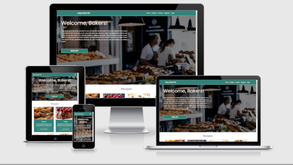

# Days Gone Pie
### Milestone Project 3 - Python and DataCentric Development

## Table of Contents
---
### 1.  UX 
- Project Goals
- User Goals
- Developer Goals
- User Stories
- Design Choices
- Wireframes
---
### 2. Features
- Existing Features
- Features Left to Implement
---
### 3. Technologies Used
- Front End
- Back End
---
### 4. Testing
---
### 5. Deployment
- How to Deploy to a Cloud Based Server
- How to Deploy Locally
---
### 6. Credits
- Content
- Media
- Code
- Acknowledgements
>
>
>
>

## 1. UX
---